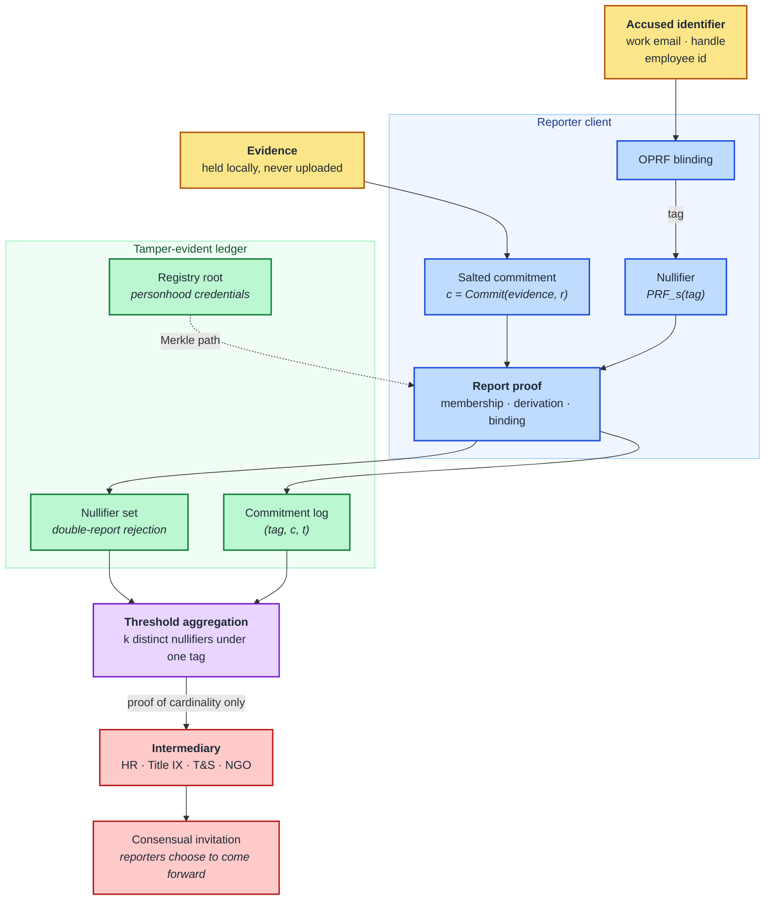

# SafeProof: A privacy-preserving harassment and abuse reporting network with nullifier-based Sybil resistance and threshold zero-knowledge disclosure.

This repository studies a reporting protocol for workplace sexual harassment and online harassment/stalking in which a reporter can establish **that a pattern of abuse exists** and **that they are a distinct, real, independent reporter**, without disclosing their identity or the content of their evidence until they consent to do so. The construction combines a tamper-evident ledger of salted evidence commitments, a nullifier scheme for one-report-per-person-per-target, and a threshold zero-knowledge proof that attests to the *cardinality* of distinct credible reports against a target identifier while revealing nothing about the reporters or their accounts.

**Project page (ACM womENcourage™ 2026 Hackathon):** https://ttgenproject.github.io/safeproof-zkp/

The page is a static site built from [Academic-Project-Page-Template](https://github.com/YizheXie/Academic-Project-Page-Template) (MIT, see [assets/LICENSE-template.txt](assets/LICENSE-template.txt)). Its text lives in [content/sections/](content/sections/), its metadata in [content/site.json](content/site.json), and its figures in [content/media/](content/media/). To preview it locally, serve the repository root over HTTP, because the page fetches its JSON and Markdown:

```bash
python -m http.server 8000   # then open http://localhost:8000
```

---

## 1. Repository structure

```text
.
├─ apps/
│  ├─ web/                    # reporter intake UI + intermediary (HR / T&S / NGO) console
│  └─ prover/                 # proof service: report proofs and threshold aggregation
├─ packages/
│  ├─ contracts/              # ledger logic: registry, commitments, nullifier set, escrow
│  ├─ zk-circuits/            # report circuit, aggregation circuit, gadgets
│  ├─ identifier-oprf/        # blinded target-identifier derivation (OPRF service + client)
│  └─ safeproof-sdk/          # shared TS SDK: commitments, proof orchestration, tx builders
├─ agents/
│  ├─ figures/                # evaluation figures
│  └─ generate_figures.py     # plotting scripts
└─ docs/                      # protocol specification, threat model, ethics & legal notes
```

> [!CAUTION]
> This is a research prototype and **not** a support service, a legal instrument, or a substitute for trauma-informed care. Nothing here should be deployed against real reporters without institutional review, legal counsel in the relevant jurisdiction, and a survivor-advocacy partner. 

## 2. Problem statement

Sexual harassment at work and harassment or stalking on online platforms share a *structural* barrier to reporting, distinct from the emotional one. Four properties of current intake systems are individually well documented and jointly disabling:

| Structural barrier | Consequence for the reporter |
|---|---|
| **Identity exposure.** Reporting attaches a name to a complaint that HR, a platform trust & safety team, or eventually the accused may see. | Retaliation risk (professional, social, occasionally physical) is borne entirely by the reporter and is incurred *before* any determination is made. |
| **Repeated retraumatisation.** Each platform, intake form, and investigator requires the account to be retold from scratch, typically to someone with no view of the history. | The cost of reporting scales linearly with the number of contexts in which the abuse occurred. |
| **The single-report dismissal.** One report is discountable as one person's word; patterns are not. | To learn that they are not the only one, a reporter must first expose themselves — the information they need to justify the risk is available only after taking the risk. |
| **Cross-context blindness.** The same person harassing a colleague at work and stalking a different woman on a social platform appears as two unrelated incidents. | The evidence that is most probative — recurrence across environments — is precisely the evidence no single institution can observe. |

## 3. Protocol

### 3.1 Blinded target identifiers

A report is filed against a **target identifier**: a work email, an employee number, a platform handle, a Discord user id — something that persistently and uniquely denotes the accused, never the reporter. Committing `H(identifier)` directly to a public ledger would be catastrophic: the identifier space is small and enumerable, so any observer could dictionary-attack the ledger and learn who has been reported and how often. The prototype therefore derives the ledger key through an **oblivious pseudorandom function**, `tag = OPRF_k(identifier)`, evaluated jointly by the client and a key-holding service that never sees the identifier and cannot compute tags offline without a client interaction. This is the same defence Callisto's matching escrow applies to perpetrator identifiers [A1], and it is load-bearing: without it, the anonymity of the *reporter* is preserved while the *accused* is exposed to unaccountable public accusation, which is a different but equally serious failure.

### 3.2 Anonymous evidence commitment

The reporter never uploads evidence. The client computes a salted commitment
`c = Commit(evidence ‖ narrative, r)` over the material it holds locally — a message screenshot, an email, a written account, a witness statement — and submits `(tag, c, t)` where `t` is a coarsened timestamp. The ledger stores the commitment and the time; the plaintext and the salt `r` stay with the reporter.

The property this buys is narrow and worth stating precisely: it does **not** prove the evidence is genuine, and it does not prove the account is truthful. It proves that *this specific material existed in this form no later than `t`*, which forecloses the two most common procedural attacks in harassment disputes — retroactive dispute of a timeline, and the claim that a report was fabricated after some later triggering event. Authenticity remains a question for the investigation the threshold event initiates.

### 3.3 Nullifier-based Sybil resistance

Each reporter holds a secret `s` and a leaf `Commit(s)` in a registry Merkle tree, admitted by an issuer that attests to personhood without learning what the credential is subsequently used for (institutional SSO, an NGO-operated identity check, or an existing personhood credential). For a report against `tag`, the client derives

```
nullifier = PRF_s(tag)
```

and the ledger rejects any nullifier already present. This is the Semaphore/Zcash-style construction [A2, A3]: the nullifier is deterministic in `(s, tag)`, so a given person can file at most one report against a given target, and it is pseudorandom across targets, so reports filed by the same person against different targets are unlinkable.

The circuit proves, in zero knowledge, that (i) the leaf `Commit(s)` is in the registry tree at a known root, (ii) the nullifier is correctly derived from the same `s` and the claimed `tag`, and (iii) the commitment `c` is bound to this report. It reveals `(root, tag, nullifier, c, t)` and nothing else.

> [!IMPORTANT]
> Sybil resistance here is *exactly* one-report-per-registered-person-per-target, and no stronger. It does not establish that the reporter had any contact with the accused, and it inherits every weakness of the issuer's personhood check. A registry that admits duplicates admits Sybils; the cryptography faithfully enforces a property the issuer may have failed to establish.

### 3.4 Threshold proof and escalation

Nothing is published when a report is filed, and nothing is published when the threshold is crossed. Once `k` distinct nullifiers exist under one `tag`, an aggregation proof is produced asserting:

> *There exist `k` pairwise-distinct nullifiers under `tag`, each derived from a distinct registered credential, each bound to a commitment recorded at or before its stated time.*

Two mechanisms are under evaluation for what the threshold *unlocks*, and they differ in where trust sits:

| Mechanism | How it works | Trust placed in |
|---|---|---|
| **Recursive proof over the nullifier set** | The prover folds `k` report proofs into one recursive proof of cardinality; the intermediary verifies the aggregate. | The proof system only. The intermediary learns `k` and nothing else — not even encrypted identities. |
| **`k`-of-`n` matching escrow** | Each report carries a share of a per-`tag` key encrypting the reporter's contact channel; the `k`-th report makes reconstruction possible [A1, A4]. | The escrow operator's key handling, and the assumption that fewer than `k` shares leak nothing. |



### 3.5 Cross-context linking

Because the tag is derived from an identifier rather than from a context, reports filed from a work Slack handle, a conference badge, an X account, and a Discord server can be shown to concern one target — but only when the identifiers are known to be co-referent, which is not a cryptographic fact. Two designs are possible, and the choice is consequential rather than technical:

- **Reporter-asserted linking.** A reporter who knows two identifiers belong to the same person files under a linked tag pair. Cheap, no new trust, and wrong whenever the reporter is mistaken or malicious.
- **Attested linking.** An issuer or platform attests co-reference (for example, a verified email on a platform account) and the circuit consumes the attestation. Sound, but reintroduces a party that learns which identifiers are being linked.


## 4. Ethical and legal considerations

These are not appendices to the design; several of them constrain it.

- **Mandatory reporting.** In many jurisdictions a designated intermediary incurs a legal duty to act on notice of certain conduct. A threshold notification may therefore start a process the reporters did not choose. This must be disclosed at intake, in plain language, before a report is filed.
- **Consent is per-step, never inherited.** Filing is not consent to escalation; escalation is not consent to identification; identification to one intermediary is not consent to another.
- **The threshold parameter is a policy instrument.** Setting `k` trades the risk of an unheard reporter against the risk of an unfounded investigation. It belongs to the deploying institution and its survivor-advocacy partner, not to this repository.
- **Due process for the accused.** A threshold event is an input to an investigation, never a finding. The system deliberately produces no evidence of wrongdoing — only evidence that distinct people filed.
- **Not a support service.** Any deployment must route to human support, and must not present cryptographic guarantees as safety.

## References

### Academic references

[A1] Rajan, A., Qin, L., Archer, D. W., Boneh, D., Lepoint, T., Varia, M. "Callisto: A Cryptographic Approach to Detecting Serial Perpetrators of Sexual Misconduct." ACM COMPASS 2018. https://dl.acm.org/doi/10.1145/3209811.3212699

[A2] Hopwood, D., Bowe, S., Hornby, T., Wilcox, N. "Zcash Protocol Specification" — nullifier construction for double-spend prevention under anonymity. https://zips.z.cash/protocol/protocol.pdf

[A3] Semaphore — anonymous signalling with Merkle-tree membership and external nullifiers. https://semaphore.pse.dev/

[A4] Shamir, A. "How to Share a Secret." Communications of the ACM, 22(11), 1979. https://dl.acm.org/doi/10.1145/359168.359176

[A5] Jarecki, S., Kiayias, A., Krawczyk, H. "Round-Optimal Password-Protected Secret Sharing and T-PAKE in the Password-Only Model" — OPRF constructions underlying blinded identifier derivation. IACR ePrint 2014/650. https://eprint.iacr.org/2014/650

[A6] Gabizon, A., Williamson, Z. J., Ciobotaru, O. "PLONK: Permutations over Lagrange-bases for Oecumenical Noninteractive arguments of Knowledge." IACR ePrint 2019/953. https://eprint.iacr.org/2019/953

[A7] Groth, J. "On the Size of Pairing-Based Non-interactive Arguments." EUROCRYPT 2016. https://eprint.iacr.org/2016/260

### Code inspirations

[C1] Semaphore protocol — reference implementation of the membership-plus-nullifier circuit pattern. https://github.com/semaphore-protocol/semaphore

[C2] Tornado Cash circuits — Merkle membership and nullifier gadgets in circom. https://github.com/tornadocash/tornado-core
