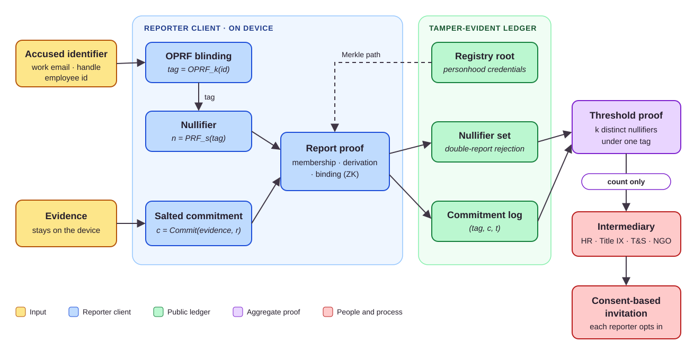

# SafeProof

**Privacy-preserving harassment reporting with nullifier-based Sybil resistance and threshold zero-knowledge disclosure.**
Built for the [ACM womENcourage™ 2026 Hackathon](https://womencourage.acm.org/2026/index.php/join-the-hackathon/).

[Project page](https://ttgenproject.github.io/safeproof-zkp/) · [Slides](https://docs.google.com/presentation/d/1safyND00YSxTISNe_1uOfcl1YdIe6vnb/edit?usp=sharing)

## Idea

Reporting harassment means exposing yourself before you know whether anyone else has reported the same person. SafeProof lets a reporter prove two things without revealing their identity or their evidence:

- **A pattern exists:** at least *k* people have reported the same target.
- **They are one distinct, real reporter:** each registered person can report a given target only once.

The intermediary (HR, trust & safety, or an NGO) learns only that the threshold has been reached. Each reporter then decides whether to come forward.

## Protocol



1. **Blinded target.** `tag = OPRF_k(identifier)`. The ledger never stores the accused's identifier, so it cannot be searched by name.
2. **Evidence commitment.** `c = Commit(evidence, r)`. Evidence stays on the device. The commitment proves the evidence existed by time `t`, not that it is true.
3. **Nullifier.** `nullifier = PRF_s(tag)`. This allows one report per person per target, and the same person's reports against different targets can't be linked. A ZK proof shows registry membership, correct derivation, and binding to `c`.
4. **Threshold proof.** Once `k` distinct nullifiers exist under one tag, an aggregate proof reveals only the count. The design uses either a recursive proof or a `k`-of-`n` escrow.

## Limits

> [!CAUTION]
> SafeProof is a research prototype. It is not a support service, a legal instrument, or a substitute for trauma-informed care.

- Sybil resistance is only as strong as the issuer's personhood check.
- A threshold event is a reason to investigate, never a finding. Consent is required at every step.
- The threshold `k` is a policy choice for the deploying institution and its survivor-advocacy partner.

## Repository

```text
index.html, assets/          static project page (from Academic-Project-Page-Template, MIT)
content/site.json            page metadata and links
content/sections/*.md        page text
content/media/               figures
.github/workflows/pages.yml  GitHub Pages deployment
```

Planned components: web intake UI, proof service, ZK circuits, ledger contracts, OPRF service, TypeScript SDK.

**Preview locally:** run `python -m http.server 8000`, then open http://localhost:8000.
**Deploy:** every push to `main` publishes the page. This requires *Settings → Pages → Source: GitHub Actions*.

## References

- Rajan et al. [Callisto](https://dl.acm.org/doi/10.1145/3209811.3212699). ACM COMPASS 2018.
- [Zcash Protocol Specification](https://zips.z.cash/protocol/protocol.pdf): nullifiers.
- [Semaphore](https://semaphore.pse.dev/): Merkle membership with nullifiers.
- Shamir. [How to Share a Secret](https://dl.acm.org/doi/10.1145/359168.359176). CACM 1979.
- Jarecki, Kiayias, Krawczyk. [OPRF-based PPSS](https://eprint.iacr.org/2014/650). ePrint 2014/650.
- Gabizon et al. [PLONK](https://eprint.iacr.org/2019/953) · Groth. [Groth16](https://eprint.iacr.org/2016/260).
